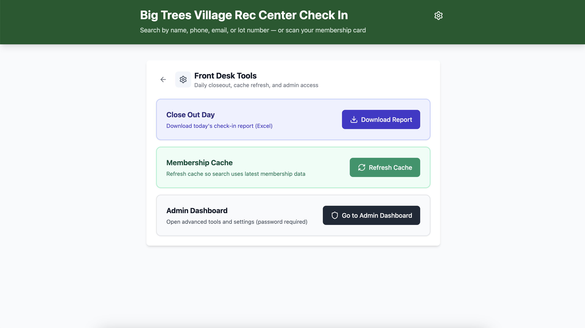
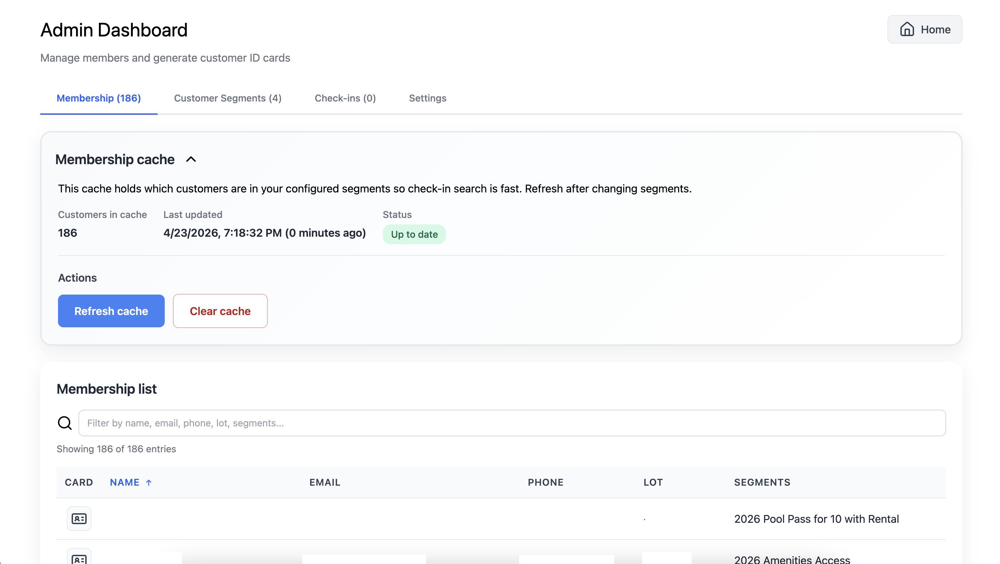
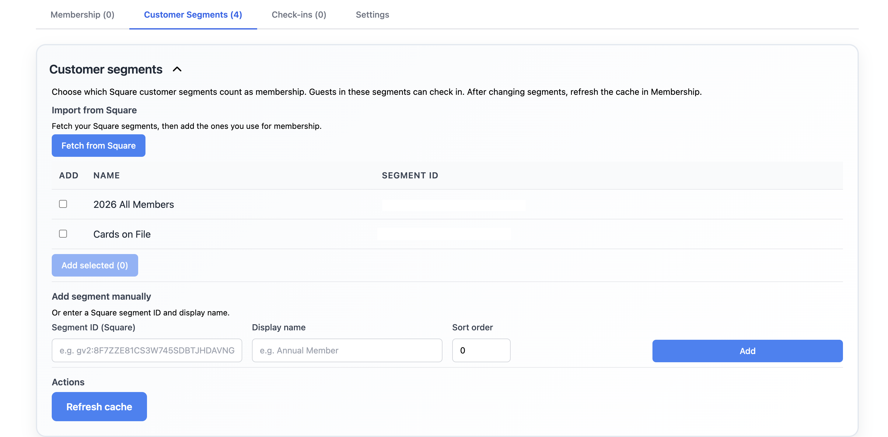
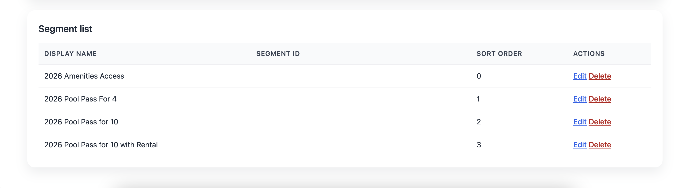
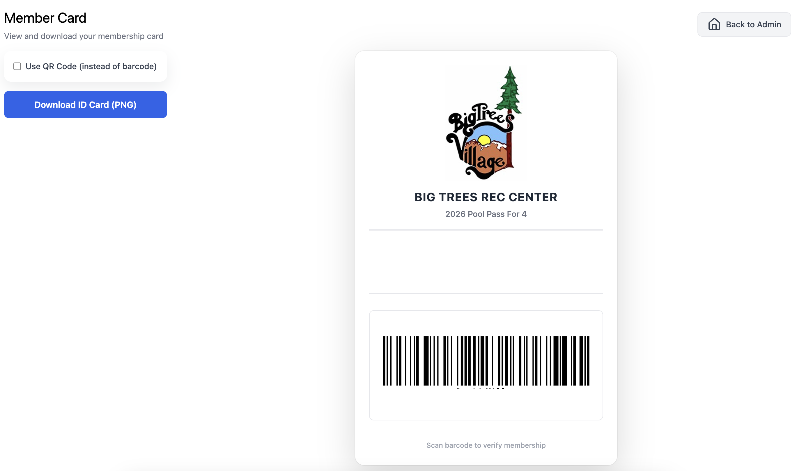

# Admin guide

Overview and troubleshooting guide for **supervisors or managers** who support the Front Desk Check In App and/or Square account

## Square and the app

Customer **names, phones, emails, and lots** live in **Square**. In Square, you use **Smart Filters** to group customers by membership type; in the Square API these appear as **customer segments**. In this app, Admin is configured with which customer segments count as each membership group for check-in.

---

## Opening Admin

On the check-in home screen, click the **gear** icon to open **Front Desk Tools**.  
In the Front Desk Tools panel, click the **Admin Dashboard** link to access the Admin area.

When you are finished, click **Home** to return to the main check-in screen.

**Admin password:** `PoolParty`

This password is only to prevent accidental changes at the front desk. It is not intended to protect highly sensitive data.

Only people you trust with member data and exports should use this screen.

---

## What each Admin tab is for

**Membership** — See who is in the membership cache, whether the cache is up to date, and **refresh** or **clear** it after you change segments or if many searches look wrong. Use the **Card** (ID icon) on a row to open a printable member card when needed.

**Customer Segments** — Choose which Square **segments** count as members. After any change here, go to **Membership** and refresh the cache.

**Check-ins** — Browse recent member and day-pass check-ins on this PC. Use **Export to Excel** to download the **full** check-in history from the local database (no row limit), or filter the list first to export a subset only. The same full-history export is also available from **Front Desk Tools → Check-in Reports → Full History** without opening Admin.

**Settings** — Copy paths to files on this computer for troubleshooting and backups: the **daily check-in CSV backups** folder (one automated file per calendar day), the **app log** (startup, API errors, cache refresh — send to IT when something fails), and the **app data folder** (database, Square token, and logs). Also where you **delete the Square access token** when IT rotates credentials.

---

## Install and first launch

Use this when setting up a new front desk PC.

1. Run the Windows installer and finish the steps.
2. Open **Front Desk App**.
3. When asked, paste your **Square access token** and click **Continue**.

The token is stored only on that computer (see **Admin → Settings → All app data** for the folder on this PC). To change the token later, use **[Replace the Square access token](#replace-the-square-access-token)** when IT directs you to do so.

### If installer security warnings appear

Only bypass these warnings if the installer came from your trusted internal source.

- **Windows (SmartScreen):** In the warning window, click **More info** and then **Run anyway**.
- **macOS (Gatekeeper):**
  1. Try opening the app once so macOS shows the warning.
  2. Open **System Settings** -> **Privacy & Security**.
  3. Under the blocked app message, click **Open Anyway**, then confirm.
  4. If prompted again, right-click the app and choose **Open** to approve it.

If these options are unavailable, contact IT/admin support to verify the installer file and permissions on that computer.

---

## First-time setup

Use this once on a new install (or anytime your program changes which Square groups count as members).

1. Open **Admin** from the home screen gear icon and enter the password.
2. Go to **Customer Segments**.
3. Click the fetch/sync control to pull the latest segment list from Square.

4. In the segment list, select the segments that should count as **membership** for your site.
5. Save/apply your segment selections.

6. Go to **Membership** and click **Refresh Cache**.
7. Wait for refresh to finish, then confirm members appear in the membership list and test one search on the front desk screen.

---

## Common actions

### Get check-in / access records

Besides checking guests in, this is the most common task on the front desk PC. There are two main ways to download check-ins, plus a backup if something goes wrong.

#### Daily check-ins (normal end-of-day handoff)

Use this at the end of each shift or day when you need **today’s** check-ins for your manager.

1. On the check-in home screen, tap the **gear** icon to open **Front Desk Tools**.
2. Under **Check-in Reports**, tap **Today's Check-ins**.
3. Save the Excel file when prompted, then email it to your manager.

#### Full check-in history (managers / supervisors)

Use this when you need **every** check-in stored on this PC — for example, a month-end report or recovering records after a gap.

**From Front Desk Tools:**

1. On the check-in home screen, tap the **gear** icon to open **Front Desk Tools**.
2. Under **Check-in Reports**, tap **Full History**.
3. Save the Excel file when prompted.

**From Admin (when you also need to browse or filter first):**

1. Open **Admin** (gear → **Admin Dashboard**) and sign in.
2. Go to the **Check-ins** tab.
3. Click **Export to Excel** to download the complete history (no row limit). To export only part of the list, type in the filter box first, then export.

Names in the export come from the membership cache on this computer.

#### Backup CSV files (if export or the database has trouble)

The app automatically saves a **daily CSV backup** on this PC — one file per calendar day. If **Export to Excel** fails, the admin screen looks wrong, or you suspect a database problem, you can open those files directly:

1. Open **Admin → Settings**.
2. Next to **Daily check-in CSV backups**, click **Copy path**.
3. Paste the path into File Explorer (Windows: **Win+R**) or Finder on Mac (**Go → Go to Folder**), then open the CSV for the day you need.

For routine daily handoff, still use **Today's Check-ins** under **Check-in Reports** on the home screen — the CSV folder is mainly a safety net.

### Refresh membership cache

Use this after changing customer segments in Square or when many member searches look wrong.

1. Open **Admin** and go to **Membership**.
2. Click **Refresh Cache** and wait for completion.
3. Test one member search from the front desk home screen.

If results still look wrong, verify the guest is assigned to one of the selected Square segments, then use the segment fetch action in **Customer Segments** and refresh cache again.

### Create and download member ID card images

Use this when a member needs a printable or shareable card image.

1. Open **Admin** and go to **Membership**.
2. Find the member and click the **Card** icon on their row.
3. On the Member Card page, confirm the member details and barcode/QR setting.
4. Click **Download ID Card (PNG)** to save the image file.

You can then use the PNG in several ways:
- Print at home on standard paper, then trim to size.
- Print in office (paper or card stock) and laminate for longer use.
- Keep/send the PNG digitally (email, cloud folder, or phone) when a physical card is not needed.

### Replace the Square access token

> [!WARNING]
> **Do not use this unless IT explicitly asks you to.** Deleting the Square token is a dangerous operation — if done at the wrong time or without a valid replacement token ready, check-ins and membership sync will stop working until the app is fixed.
>
> Only perform the steps below when IT has rotated the token or told you to sign in with a different production token on this PC.

1. Open **Admin** (gear on the home screen → **Admin Dashboard**) and sign in.
2. Go to the **Settings** tab.
3. Under **Square access token**, click **Delete Square token**.
4. Read the confirmation message, then click **Yes, delete token**.
5. **Fully quit** the Front Desk App (close the window and exit from the system tray on Windows if the app is still running).
6. Open **Front Desk App** again.
7. When prompted, paste the **new** Square access token and click **Continue**.

Until you complete steps 5–7, check-ins and membership cache refresh will not reach Square (the old token is removed from disk but the running app may still be using it until restart).

**Manual alternative (IT-directed only):** In **Admin → Settings**, copy the **All app data** path, delete `square-access-token.txt` from that folder, then quit and reopen the app.

---

## Troubleshooting (what to try first)

| Situation | What to try |
|-----------|-------------|
| One person’s name or phone is wrong | Update them in **Square**, then search again. |
| One person shows the wrong membership | In Square, fix their **segment** (or group) for your program; in Admin **Membership**, **refresh** the cache. |
| Many people wrong or “empty” | Admin → **Customer Segments** — confirm the right segments are selected; **Membership** — **refresh** cache. If it still fails, call IT (Square or network may be down). |
| App window blank or won’t open | Fully close the app and reopen. Check that the PC is online. If it persists, call **IT** with **app.log** (copy the path from **Admin → Settings**) and the date/time it failed. |
| Check-ins fail for everyone / “readonly database” | Fully quit the app. In **Admin → Settings**, use **Copy path** under **All app data** to confirm the database folder exists on this PC. Send **app.log** to IT. |
| “See the manager on duty” / check-in errors | Note what the guest was doing (search, day pass, scan). Call **IT** if it keeps happening after a restart. |

For any membership issue, first run **Refresh Cache** in Admin. If that does not fix it, escalate to a **manager** so they can review the guest in Square and diagnose further.

### What to send IT

When escalating a problem, collect:

1. **App log** — In **Admin → Settings**, click **Copy path** next to **App log**, open that file, and send it to IT from the time the problem started through the last restart.
2. **What happened** — Approximate time, guest name or customer ID, and what was on screen (search, check-in, Admin refresh, etc.).
3. **Database (if IT asks)** — With the **app fully closed**, zip the files in **All app data** (especially `checkin.db` and any `checkin.db-wal` / `checkin.db-shm` files). Do **not** delete those files on the live PC unless IT instructs you to.
