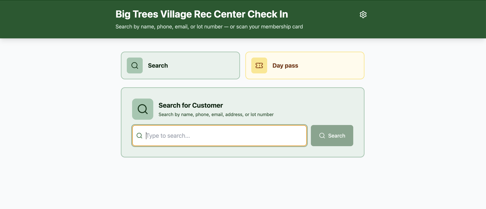
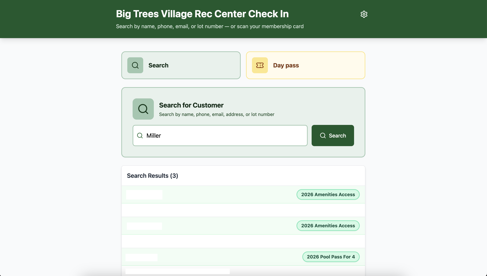
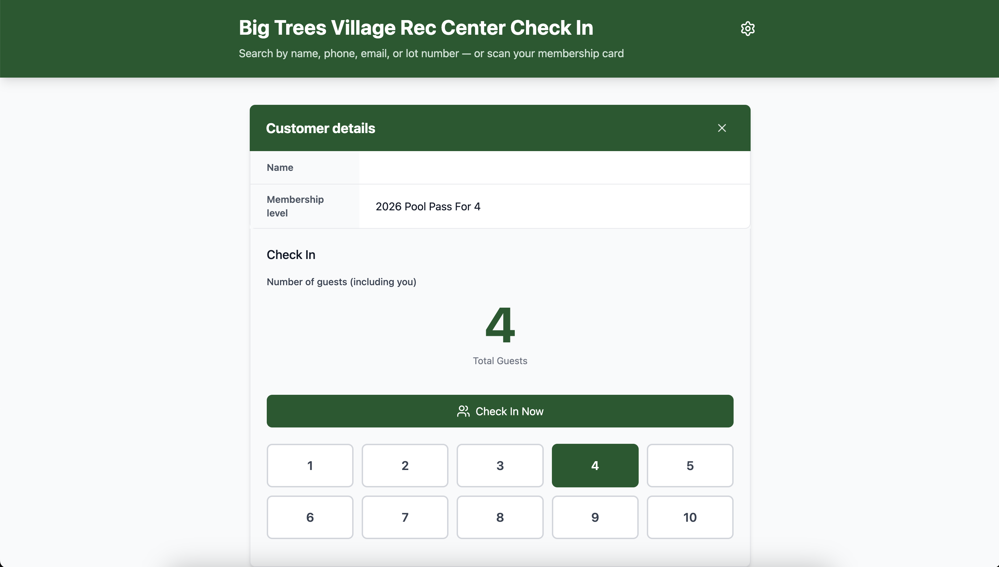

# Front Desk App Staff Guide

This guide explains how front desk staff should use the **Front Desk App** at Big Trees Village Rec Center during normal check-in operations.

## What is the Front Desk App

The front desk app is how front desk staff :
- Check in members when they arrive at the facility
- Check in day pass guests (after purchase)
- Records daily check-ins so management can more effectively plan shifts

### Home screen actions

| Action | When to use it |
|--------|----------------|
| **Search** | Guest is a known member in the system. |
| **Day pass** | Guest paid for a day pass and is not in the member list. |
| **Gear (Front Desk Tools)** | Check-in report downloads, cache refresh, and admin access. |

Most check-ins should start in **Search**. If a guest has a scannable card, scan into the search field instead of typing.

## Common tasks
### Start of shift

1. Open **Front Desk App** from the desktop or Start menu and wait for the home screen to fully load before helping guests.

### Checking in a member

1. Tap **Search** (if not already selected).
2. Enter information provided by the member (name, phone, email, address, or lot number), then tap **Search** or press Enter.
   - Partial information is ok
   - If the guest has a scannable card, use the scanner input instead.
3. In the results, select the customer

   - See the membership level for the customer in the green box on each search result
   - If multiple matches appear, select the correct person by verifying identity details.
   - If membership appears incorrect, stop and notify a supervisor.

5. After selecting a customer, select the number of guests total and tap **Check In Now**.

   - If the customer is bringing more guests than allowed by their membership, follow existing guideines set by management
7. Confirm the **All Set!** success message.

### Checking in a day pass
When selling a day pass to a customer it is important to also check them in for the day so the customer check-in count stays accurate.  Checking in a day pass is similar to checking in a member

1. Tap **Day pass** on the home screen
2. Select number of guests (including purchaser if entering).

3. Tap **Check in day pass**.
4. Confirm the **All Set!** message.

### End of day
At the end of the day, you must collect the daily check-ins and email them to the manager. To do this:

1. Tap the **gear** icon on the home screen to open **Front Desk Tools**.

2. Under **Check-in Reports**, tap **Today's Check-ins**.
3. Wait until the report is generated.
4. Save the downloaded Excel file when prompted.
5. Email the file to the manager as part of end-of-day closeout.

If a manager asks for **all** check-ins stored on this computer (not just today), use **Full History** in the same **Check-in Reports** section. That download includes every check-in on this PC, the same as **Export to Excel** in Admin.

## Troubleshooting

- **"No customers found"**: 
  - Recheck spelling, try alternate details (phone/email/lot)
  - Refresh membership cache using Front Desk Tools and try again
  - Ask manager if still not found.
- **"An issue with check-in, please see the manager on duty"**: 
  - Stop and contact the manager immediately.
- **Membership level looks wrong**: 
  - Notify the manager on duty
- **Report download fails**: 
  - Notify manager on duty.

