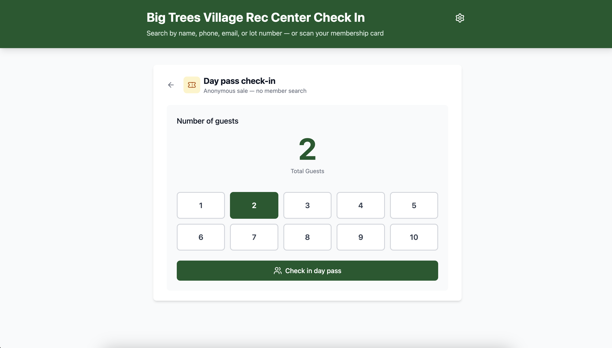

# Front desk check-in guide

Quick steps for staff using the **Front Desk App** (Windows) at Big Trees Village Rec Center.

Supervisors: see [ADMIN_GUIDE.md](ADMIN_GUIDE.md) for day-to-day issues and exports. Install or upgrade: [INSTALLATION_GUIDE.md](INSTALLATION_GUIDE.md).

Illustrations below use current app screenshots from `docs/images`.

---

## 1. Open the app

Start **Front Desk App** from the desktop or Start menu (your site may use a slightly different name). Wait until the check-in home screen loads.

---

## 2. Home screen — main actions

| Action | When to use it |
|--------|----------------|
| **Search** | Look up a member by name, phone, email, address, or lot number. |
| **Day pass** | Guest paid for a day pass and is **not** in the member list (no name search). |
| **Gear (Front Desk Tools)** | Open tools for close out day report download and admin access. |

Most check-ins should start in **Search**. If a guest has a scannable card, staff can scan it into the search field instead of typing a name.

---

## 3. Check in a member (Search)

1. Tap **Search** (if the big search card is not already in “search” mode).
2. Type at least part of the guest’s information and tap **Search** (or press Enter), or use the scanner input if the guest has a scannable card.
3. If several people appear, tap the **correct** row. Check name, email or phone, and lot if shown.
4. The green bar shows **membership** information from Square (segment names). If something looks wrong, stop and get a **supervisor**—do not try to fix Square yourself.
5. On **Customer details**, choose **Number of guests (including you)** (buttons 1–10), then tap **Check In Now**.
6. You should see **All Set!** The screen clears after a few seconds for the next guest.

---

## 4. Day pass check-in

1. Tap **Day pass**.
2. Choose how many guests (including the purchaser if they are entering).
3. Tap **Check in day pass**.
4. Confirm **All Set!** when it appears.

---

## 5. End-of-day check-in download

1. On the home screen, tap the **gear** icon (top right) to open **Front Desk Tools**.
2. In **Close Out Day**, tap **Download Report**.
3. Wait for the app to finish preparing the report.
4. Confirm the browser/app download prompt and save the file.
5. Email the downloaded file to the manager as part of close-out.

If download fails, retry once and then contact the manager on duty.

---

## 6. If something goes wrong

- Message like **“An issue with check-in, please see the manager on duty”** or **“No customers found”** → ask the **manager on duty** 
- Do **not** use the **Admin** (gear) button unless a supervisor asked you to; that screen is for the manager and administrators of the app.  Changing any settings in there can break the app.s

