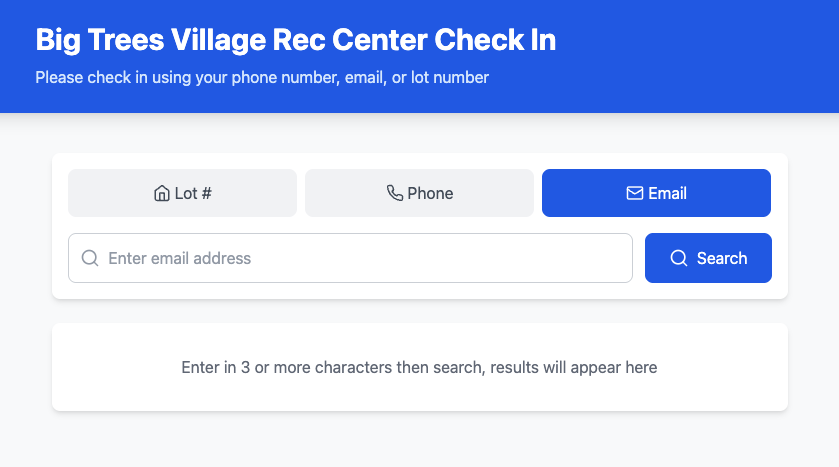

# Self Check-In App Staff Guide


*Figure 0: Home page of the Self Check-In App*
\newpage

## 1. UI Walkthrough

### Main Search Page
- **Search Options**: Phone, Email, or Lot number search
- **Search Button**: Initiates customer lookup
- **Results List**: Displays matching customers for selection


\newpage

### Check-In Page

#### Waiver Signing
If the customer hasn't signed the waiver yet, they'll see this screen with a QR code to scan and sign. Once they have signed it, click the "I've already signed" button to proceed:

*Figure 2a: Sign the waiver by scanning the QR code*

#### Guest Selection
If the customer has already signed the waiver, they'll see this screen and can select the number of guests they are bringing from the "Select Number of Guests" dropdown list:

*Figure 2b: Waiver is signed, ready for guest selection*

The screen will update to show their selection, and can click Check In Now to complete the process:


\newpage
## 3. Troubleshooting

### Common Issues

#### Customer Marked as Non-Member
- Verify customer is in "Membership 2025" Square segment by visiting:
  [Square Customer Directory - Membership 2025](https://app.squareup.com/dashboard/customers/directory/Membership%25202025-gv2:VCB62KZ83D27SADBCX65FGJ5N0)
- If customer should be a member, contact management to update the customer in Square

#### Waiver Status Issues
- **Not Showing as Signed**: 
  - If waiver was signed but not showing as such:
    1. Search for the customer manually
    2. Click the gear icon to open Admin Panel
    3. Review customer information from Square
    4. Click the check mark (✓) button to set waiver as signed:

{ width=200 }

- **Incorrectly Showing as Signed**:
  - Verify customer identity
  - To reset waiver status:
    1. Search for the customer manually
    2. Click the gear icon to open Admin Panel
    3. Review customer information from Square
    4. Click the X button to clear waiver status:

{ width=200 }

\newpage
## 4. Activity Logs

### Accessing Logs
Logs can be accessed in several ways depending on the environment:

1. **Windows Application**
   - Open Windows Event Viewer
   - Navigate to: `Windows Logs > Application`
   - Filter for events from "Rec Center Check-in" application
   - Logs are also visible in the application's console window if running in windowed mode

### Log Types
The application logs the following types of events:
- Search events
- Check-in events
- Waiver status changes
- Error messages and exceptions
- Square API interactions

### Example Log Lines

#### Customer Search
```
2024-03-15T14:30:22.123Z [ SEARCH ] Type: phone, Query: 5551234567
2024-03-15T14:30:22.234Z [ SEARCH RESULT ] Found 2 customers
```

#### Check-In Events
```
2024-03-15T14:35:00.456Z [ CHECK-IN ] Customer ID: ABC123, Guest Count: 2, First Name: John, Last Name: Doe, Lot Number: 123
```

#### Error Messages
```
2024-03-15T14:36:00.789Z [ ERROR ] Failed to search customers: Network error
2024-03-15T14:37:00.123Z [ ERROR ] Failed to update waiver status: Invalid customer ID
```

### Log Pattern Guide
- Timestamp format: `YYYY-MM-DDTHH:mm:ss.sssZ`
- Action types in brackets: `[ ACTION ]`
- Customer IDs are alphanumeric
- Error messages include specific error details

### Troubleshooting
- For application errors, check Windows Event Viewer first
- For Square API issues, look for logs containing "[ ERROR ]" or "Square API"
- For check-in issues, search for logs containing "[ CHECK-IN ]"